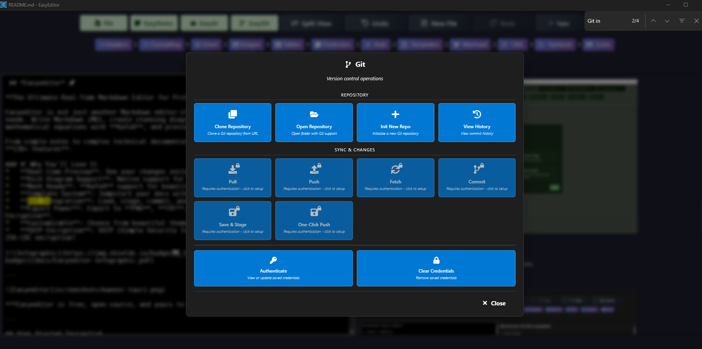
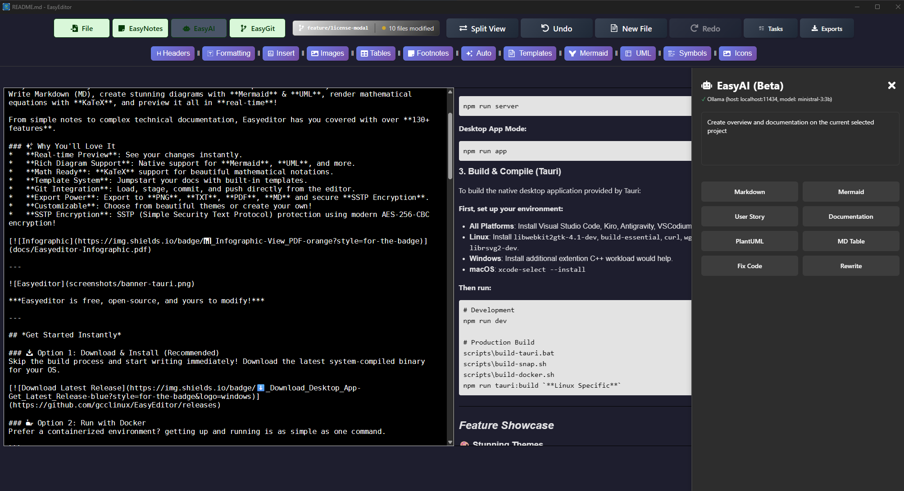
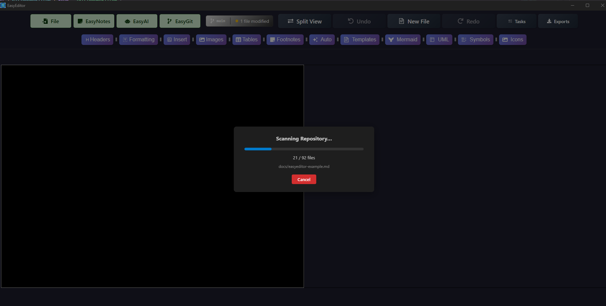
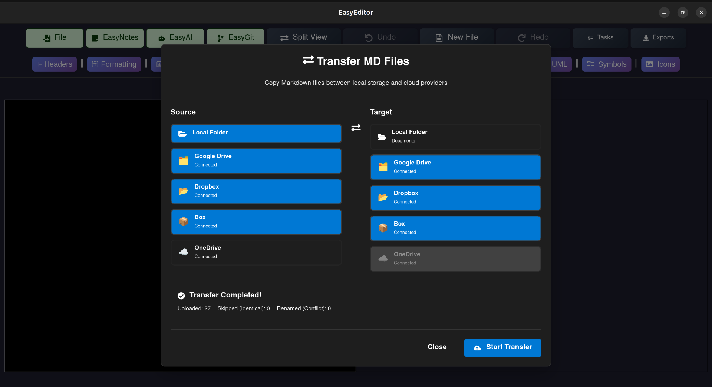

 ## *Easyeditor* 🚀

 

[🏠 Home](https://easyeditor.co.uk/) | [💻 Code](https://github.com/gcclinux/easyeditor.git) | [🌐 WebApp](https://easyedit-cloud.web.app/)

**The Ultimate Real-Time Markdown Editor for Professionals, Developers & Writers**

Easyeditor is not just another Markdown editor—it's a **powerhouse** for your documentation needs. Write Markdown (MD), create stunning diagrams with **Mermaid** & **UML**, render mathematical equations with **KaTeX**, and preview it all in **real-time**! 

From simple notes to complex technical documentation, Easyeditor has you covered with over **130+ features**.

### ✨ Why You'll Love It
*   **Real-time Preview**: See your changes instantly.
*   **Rich Diagram Support**: Native support for **Mermaid**, **UML**, and more.
*   **Math Ready**: **KaTeX** support for beautiful mathematical notations.
*   **Template System**: Jumpstart your docs with built-in templates.
*   **Git Integration**: Load, stage, commit, and push directly from the editor.
*   **Export Power**: Export to **PNG**, **TXT**, **PDF**, **MD** and secure **SSTP Encryption**.
*   **Customizable**: Choose from beautiful themes or create your own!
*   **SSTP Encryption**: SSTP (Simple Security Text Protocol) protection using modern AES-256-CBC encryption!
*   **EasyAI Personas**: Built-in AI personas for documentation, diagrams, code fixes, and more — with full repo scanning that reads your project file-by-file to generate accurate, context-aware documentation.
*   **Multi-cloud Storage**: Built-in Multi-cloud Storage to store your documents, GDrive, OneDrive,DropBox, Box.

[](docs/Easyeditor-Infographic.pdf)

---


***Easyeditor is free, open-source, and yours to modify!***

---

## *Get Started Instantly*

### 📥 Option 1: Download & Install (Recommended)
Skip the build process and start writing immediately! Download the latest system-compiled binary for your OS.

[](https://github.com/gcclinux/EasyEditor/releases)

### 🐳 Option 2: Run with Docker
Prefer a containerized environment? getting up and running is as simple as one command.

```bash
# Pull and run the latest version
docker pull ghcr.io/gcclinux/easyeditor:latest
docker run -d --name EASYEDITOR -p 3024:3024 --env-file .env.local ghcr.io/gcclinux/easyeditor:latest

docker pull gcclinux/easyeditor:1.7.2-aarch64
docker run -d --name EASYEDITOR -p 3024:3024 --env-file .env.local gcclinux/easyeditor:1.7.2-aarch64
```
*Access it at: `http://localhost:3024`*

### 🌐 Option 3: Use the Web App
No installation required! Try the full power of Easyeditor directly in your browser.

[](https://easyeditor-cloud.web.app/)

---

## *Build from Source*
For contributors and those who want to customize the codebase.

### Prerequisites
*   Node.js & npm
*   Git
*   Rust (for Tauri Desktop App)

### 1. Clone & Install
```bash
git clone https://github.com/gcclinux/easyeditor.git
cd easyeditor
npm install
```

### 2. Run Locally
**Web Server Mode:**
```bash
npm run server
```

**Desktop App Mode:**
```bash
npm run app
```

### 3. Build & Compile (Tauri)
To build the native desktop application provided by Tauri:

**First, set up your environment:**

*   **All Platforms**: Install Visual Studio Code, Kiro, Antigravity, VSCodium or any other prefered IDE
*   **Linux**: Install `libwebkit2gtk-4.1-dev`, `build-essential`, `curl`, `wget`, `libssl-dev`, `libayatana-appindicator3-dev`, `librsvg2-dev`.
*   **Windows**: Install additional extention C++ workload would help.
*   **macOS**: `xcode-select --install`

**Then run:**
```bash
# Development
npm run dev

# Production Build
scripts\build-tauri.bat
scripts\build-snap.sh
scripts\build-docker.sh
npm run tauri:build `**Linux Specific**`
```

---

## *Feature Showcase*

### 🎨 Stunning Themes
Select from a variety of themes or create your own to match your style.

<a></a>

### 📊 Powerful Diagrams & Math
Visualize your ideas with **Mermaid** charts and **KaTeX** equations.

**KaTeX Example:**

<a></a>

**Template Online Gallery:**

<a></a>

### 🐙 EasyGit Integration
Seamlessly manage your version control without leaving the editor.

<a></a>

### 🤖 EasyAI Personas
Multiple AI personas for documentation, diagrams, code fixes, user stories, and more. The Documentation persona scans your entire Git repository file-by-file to produce accurate, project-specific documentation.

<a></a>

**Repo Scanning for Documentation:**

<a></a>

**Transfer Markdown Documentation**

<a></a>

### 📝 Table Support
Clean and responsive table rendering.

| Feature | Support |
| :--- | :--- |
| **Markdown** | ✅ |
| **Mermaid** | ✅ |
| **KaTeX** | ✅ |
| **SSTP Encryption** | ✅ |

---


## *License*
This project is licensed under the GNU Affero General Public License (AGPLv3) with Commons Clause and Trademark Protection.

### *What this means:*

✅ Open Source - Anyone can view, modify, and use the code  
✅ Community Contributions - Improvements must be shared back  
✅ Free to Use - No cost for personal or internal use  
❌ No Commercial Sale - Cannot sell EasyEditor or derivatives  
❌ No Rebranding - Cannot rebrand as "EasyEditor Pro" or similar  
❌ No Proprietary Forks - Cannot create closed-source versions  

### *You can:*

Use Easyeditor for any purpose (free)  
Modify the code for your needs  
Use it in your projects (non-commercially)  
Distribute modified versions (non-commercially, with attribution)  
Contribute improvements back to the project  

### *You cannot:*

Sell Easyeditor or any derivative  
Offer Easyeditor as a paid service  
Charge for hosting or support  
Rebrand it as your own product  
Create proprietary versions  
Remove attribution or license notices  

## *Quick Links*

[](https://www.easyeditor.co.uk) 
[](https://gcclinux.github.io/EasyEditor/docs) 
[](docs/Easyeditor-Infographic.pdf) 
[](https://github.com/gcclinux/EasyEditor/releases) 
[](https://github.com/gcclinux/EasyEditor) 
[](https://github.com/gcclinux/EasyEditor/stargazers) 
[](LICENSE) 

## *Support & Community*

[](https://github.com/gcclinux/EasyEditor/issues)
[](https://github.com/gcclinux/EasyEditor/discussions)
[](https://www.buymeacoffee.com/gcclinux)
