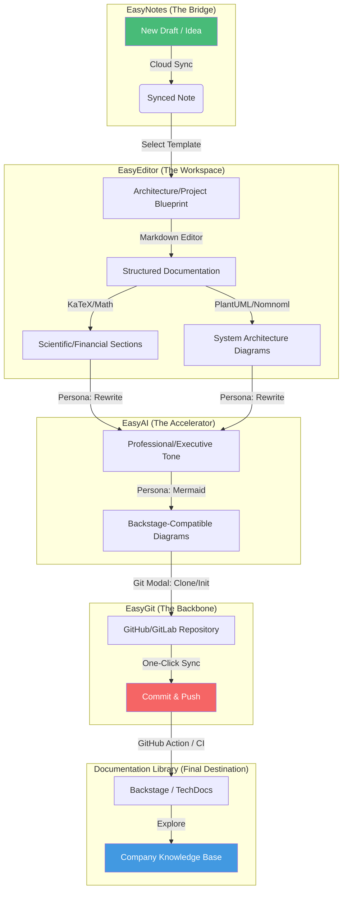

# EasyEditor Ecosystem: From Draft to Deployment

The Easy Ecosystem is a suite of integrated tools designed to streamline the lifecycle of technical documentation, project planning, and architectural design. By combining a powerful Markdown editor with AI acceleration, cloud synchronization, and native Git integration, it provides a seamless "all-in-one" experience for developers, architects, and technical writers.

---

## 🏗️ Core Components

The ecosystem is built on four pillars that work together to simplify your workflow:

### 1. EasyEditor (The Foundation)
The core Markdown editor designed for speed and clarity. It supports GitHub Flavored Markdown (GFM), real-time side-by-side preview, and extensive formatting options.
- **Key Feature:** Live rendering of advanced modules: **Mermaid**, **PlantUML**, and **KaTeX Mathematics**.
- **Key Feature:** Library of dozens of professional templates for rapid document creation.

### 2. EasyNotes (The Bridge)
A cloud-powered sidebar that manages your working drafts and keeps them synchronized across devices.
- **Key Feature:** Multi-provider support (Google Drive, Dropbox, etc.).
- **Key Feature:** Offline-first architecture — work anywhere, sync when online.
- **Key Feature:** Premium encryption for secure cloud backups.

### 3. EasyAI (The Accelerator)
An integrated AI panel that uses specialized "personas" to generate, refine, and fix content directly within your documents.
- **Key Feature:** Specialized modes for Mermaid diagrams, User Stories, and ASCII art.
- **Key Feature:** "Fix Code" and "Rewrite" modes that analyze your existing content to provide context-aware improvements.
- **Key Feature:** Support for local LLMs (via Ollama) or cloud-based AI agents.

### 4. EasyGit (The Backbone)
Native Git integration that brings professional version control to your Markdown files.
- **Key Feature:** "One-Click Sync" (Save + Commit + Push).
- **Key Feature:** Graphical history viewer and branch management.
- **Key Feature:** Secure credential management for GitHub and other Git providers.

---

## 🔄 The "Draft to Deployment" Workflow

How the components sit together in a typical project lifecycle:

### Phase 1: Initiation (Drafting)
Start your work in **EasyEditor** using one of the built-in **Templates**. Whether it's a "Daily Journal", "Project Plan", or "App Architecture", the templates give you a structured starting point.
- **Pro Tip:** Use the **EasyNotes Sidebar** to create a new cloud-synced file so your initial draft is immediately backed up.

### Phase 2: Augmentation (AI Acceleration)
Use **EasyAI** to transform your rough notes into high-quality technical assets.
- Describe a system flow and use the **Mermaid Persona** to generate a sequence diagram.
- Describe a feature and use the **User Story Persona** to generate an Agile backlog.
- Use **Rewrite** to polish your tone or **Fix Code** to debug embedded code snippets.

### Phase 3: Collaboration (Version Control)
Once your draft is solid, use **EasyGit** to move from "personal note" to "project asset".
- **Clone** an existing repository or **Init** a new one.
- Use the **Git Modal** to Stage, Commit, and Push your changes.
- **EasyGit** handles the complexity of Git operations, ensuring your documentation lives alongside your code.

### Phase 4: Finalization (Deployment)
Your content is now ready for its final destination.
- **Markdown Export:** Save as a standard `.md` file for GitHub/GitLab.
- **PDF Export:** Generate high-quality documents for stakeholders.
- **Remote Push:** Deploy your documentation directly to a static site generator or platforms like **Backstage** (via TechDocs).

---

## 🗺️ Visual Workflow: From Draft to Backstage Documentation

The following diagram illustrates how your content flows through the ecosystem into a professional documentation library:

---

## 🎨 Features & Templates

### Smart Templates
The **Templates Modal** offers dozens of pre-configured structures, categorized for different professional needs:
- **Architecture & Engineering:** AWS/Postgres layouts, Database Replication (Master-Slave), and LLM Training Pipelines.
- **Project Management:** Kanban boards, Project Plans, Meeting Notes, and Bug Reports.
- **Scientific & Technical:** Troubleshooting Guides (Process of Elimination), Study Notes, and Diagram Examples.
- **Personal Productivity:** Daily Journals, Travel Logs, and Workout Trackers.

### Visual Diagrams & Mathematics
Don't just write; visualize and calculate. EasyEditor supports:
- **Mermaid.js:** Flowcharts, C4 diagrams, Gantt charts.
- **PlantUML/Nomnoml:** Formal UML (Class, Sequence, State) and specialized architecture diagrams.
- **KaTeX Mathematics:** Professional LaTeX math rendering for scientific and financial documentation.
    - *Inline:* `$E=mc^2$`
    - *Block:* `$$\sum_{i=1}^n i = \frac{n(n+1)}{2}$$`
- **ASCII Art:** Portable text-based diagrams for maximum compatibility.

---

## 🚀 Getting Started

1. **Open a Repository:** To get the full power of Git, use `File -> Open Repository` to give the app folder-level permissions.
2. **Connect Cloud:** Open **EasyNotes** and connect your Google Drive or Dropbox for seamless draft syncing.
3. **Configure AI:** Set up your **EasyAI** agent (Ollama for local or OpenAI for cloud) to start accelerating your writing.
4. **Master the UI:**
    - `Ctrl + Space`: Quick search/actions.
    - `Ctrl + S`: Universal save (Cloud + Local).
    - `Robot Icon`: Open EasyAI.
    - `Note Icon`: Open EasyNotes.
    - `Branch Icon`: Open EasyGit.

---

*EasyEditor: Where your ideas become documentation.*
